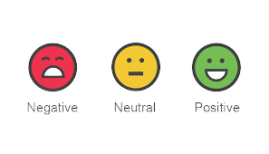

## Sentiment-Analysis

Sentiment analysis is a natural language processing (NLP) technique used to determine whether data is positive, negative or neutral. 
and often performed on textual data to help businesses monitor brand and product sentiment in customer feedback, and understand customer needs.

